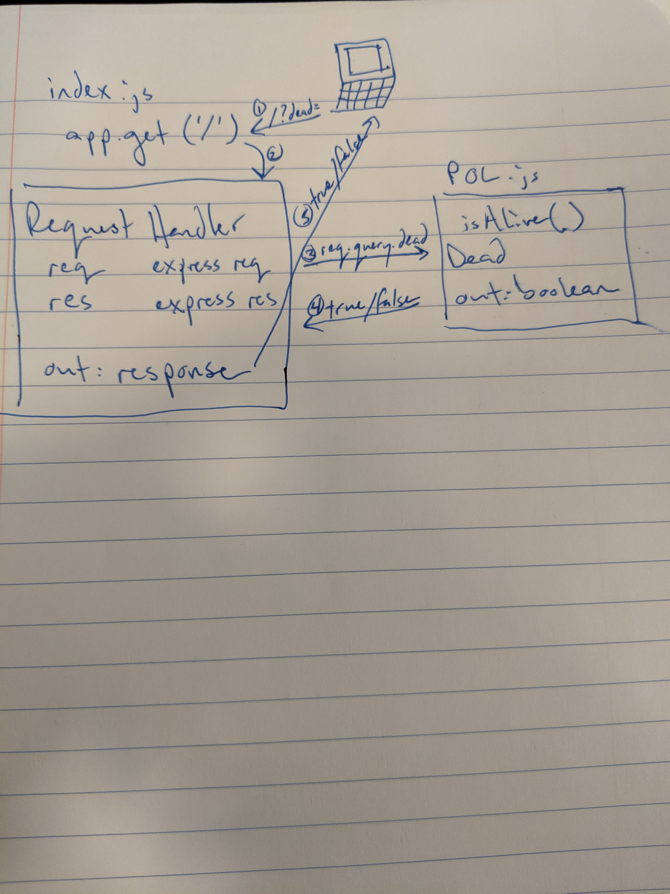

# LAB - 00

## Proof of Life Server

### Author: Evan Andrewson

### Links and Resources
* [submission PR](https://github.com/evanandrewson-401-advanced-javascript/lab-00/pull/1)
* [travis](https://travis-ci.com/evanandrewson-401-advanced-javascript/lab-00)
* [front-end](https://evanandrewson-lab-00.herokuapp.com/)

#### Documentation
* [jsdoc](https://evanandrewson-lab-00.herokuapp.com/docs/)

### Setup
#### `.env` requirements
* `PORT` - 3000

**or, include an `.env.example`**

#### Running the app

**Describe what npm scripts do**
* npm start
* Endpoint: '/'
    * Returns a boolean
* Endpoint: '/docs/'
    * Returns JSDoc Documentation Pages

  
#### Tests
* Unit Tests: 'npm test'
* Lint Tests: 'npm run lint'

#### UML
